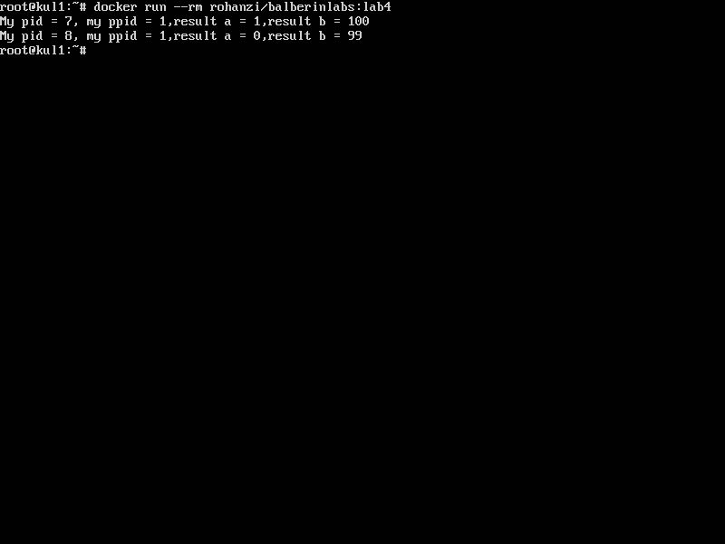

# Процессы. Системные вызовы.

### Задание

* Скачать с удаленного сервера исходные коды программ
* Исправить заголовочные файлы и остальное
* Написать **Makefile**
* Написать **Dockerfile** и сделать **Docker image** с задачей

### Выполнение

* За основной комплиятор решено было использовать `clang`, тем не менее **Makefile** позволяет через флаг `CC=` задать любой другой компилятор с синтаксисом как у `gcc`
* Легковесный дистрибутив Alpine Linux не любит грамотно распараллеливать процесс через *fork()* на число потоков большее, чем число процессоров. По этой причине решено было использовать с этой лабораторной работы дистрибутив Debian в ветке `debian:jessie-slim`, отличающуюся от основной большей облегченностью.
* Для экономии места пакеты через `apt-get` устанавливаются с флагом `--no-install-recommends`
* Для загрузки в репозиторий Docker была использована команда `docker tag`: `docker tag balberinlabs:lab4 rohanzi/balberinlabs:lab4`

### Инструкции по сборке

#### Сборка

```
cd lab4
docker build -t balberinlabs:lab4 .
```
#### Запуск
`docker  run --rm balberinlabs:lab4`


### Готовый образ

```
docker pull rohanzi/balberinlabs:lab4
docker run --rm rohanzi/balberinlabs:lab4
```

### Исходные файлы

##### Makefile

```
TARGET = lab4
PREFIX = /usr/local/bin
CC = clang

.PHONY: all clean install uninstall

all: $(TARGET)
clean:
	rm -rf $(TARGET) *.o
lab4.o: lab4.c
	$(CC) -c -o lab4.o lab4.c
pr_a.o: pr_a.c
	$(CC) -c -o pr_a.o pr_a.c
pr_b.o: pr_b.c
	$(CC) -c -o pr_b.o pr_b.c
$(TARGET): lab4.o pr_a.o pr_b.o
	$(CC) -o $(TARGET) lab4.o pr_a.o pr_b.o
install:
	install -D $(TARGET) $(PREFIX)/$(TARGET)
uninstall:
	rm -rf $(PREFIX)/$(TARGET)
```

##### lab4.c

```
/* Пример создания нового
   процесса с разной работой процессов
   ребенка и родителя */

#include <sys/types.h>
#include <unistd.h>
#include <stdio.h>

#include "lab4.h"

int main()
{
    pid_t pid, ppid;
    int a =  0;
    int b =  100; 

    int children = fork();
    if(children == -1){
        return 1;
    }
    
        pid = getpid();
        ppid = getppid();
    if(children == 0){
           b = pr_b(b);
    } else {
        a = pr_a(a);
    }
    printf("My pid = %d, my ppid = %d,result a = %d,result b = %d\n",(int)pid,(int)ppid,a,b);
    return 0;
}
```

##### lab4.h

```
///////////////////////////////////////
// lab4.h

#ifndef PR_A
    //#define DO_A(X) pr_a(X);
#define PR_A
int pr_a();
#endif /*DO_A*/

#ifndef PR_B
    //#define DO_B(X) pr_b(X);
#define PR_B
int pr_b();
#endif /*DO_B*/
```

##### pr_a.c

```
int pr_a( int x )
{
    return x + 1;
}

```

##### pr_b.c

```
int pr_b( int x )
{
    return x - 1 ;
}
```

#### Dockerfile

```
FROM debian:jessie-slim
#FROM alpine
WORKDIR /src
#RUN apk add --update clang binutils gcc clang-libs libc-dev coreutils
RUN apt-get update && apt-get install -y --no-install-recommends \
	libc6-dev clang coreutils binutils gcc make \
	&& rm -rf /var/lib/apt/lists/*
ADD ./src/* ./
RUN make all
RUN make install
#ENTRYPOINT "sh"
CMD lab4
```

### Скриншот

