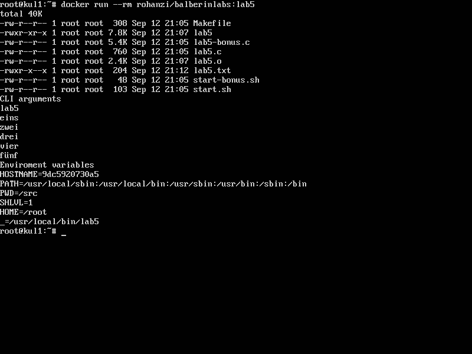

# Переменные окружения и файловые операции

### Задание

* Написать программу, которая сохраняет аргументы, передаваемые программе, а так же параметры окружения в файл lab5.txt
* Написать **Makefile**
* Написать **Dockerfile** и сделать **Docker image** с задачей

### Выполнение

Выполнение лабораторной схоже с первой работой. 

### Инструкции по сборке

#### Сборка

```
cd lab5
docker build -t balberinlabs:lab5 .
```
#### Запуск
`docker  run --rm balberinlabs:lab5`


### Готовый образ

```
docker pull rohanzi/balberinlabs:lab5
docker run --rm rohanzi/balberinlabs:lab5
```

### Исходные файлы

#### lab5.c

```
#include <string.h>
#include <stdio.h>
#include <stdlib.h>
#include <fcntl.h>
#include <unistd.h>
#include <sys/types.h>
#include <sys/stat.h>
int main(int argc, const char * argv[], const char *envp[])
{
    char data[8000];
    strcat(data, "CLI arguments\n" );
    for (int i=0; i<argc; i++) {
        strcat(data, argv[i]);
        strcat(data, "\n");
    }
    strcat(data, "Enviroment variables\n" );
    for (int i=0; envp[i]; i++) {
        strcat(data, envp[i]);
        strcat(data, "\n");
        
    }
        //файловые дескрипторы
    int filedesc = open("lab5.txt", O_CREAT | O_TRUNC | O_WRONLY, S_IRUSR | S_IXUSR | S_IWUSR | S_IRGRP | S_IXGRP | S_IXOTH);
    write(filedesc, data, strlen(data));
    close(filedesc);
    
}
```

#### start.sh

```
#!/bin/bash
# Посылаем аргументы
lab5 First 2nd tHiRd arg kek lol thats boring
ls -l -h
cat lab5.txt

```

#### Makefile

```
TARGET = lab5
PREFIX = /usr/local/bin
CC = clang

.PHONY: all clean install uninstall

all: $(TARGET)
clean:
	rm -rf $(TARGET) *.o
lab5.o: lab5.c
	$(CC) -c -o lab5.o lab5.c
$(TARGET): lab5.o
	$(CC) -o $(TARGET) lab5.o
install:
	install -D $(TARGET) $(PREFIX)/$(TARGET)
uninstall:
	rm -rf $(PREFIX)/$(TARGET)
```

#### Dockerfile

```
FROM debian:jessie-slim
#FROM alpine
WORKDIR /src
#RUN apk add --update clang binutils gcc clang-libs libc-dev coreutils
RUN apt-get update && apt-get install -y --no-install-recommends \
	libc6-dev clang coreutils binutils gcc make \
	&& rm -rf /var/lib/apt/lists/*
ADD ./src/* ./
RUN cp start.sh /usr/local/bin/start.sh
RUN chmod 755 /usr/local/bin/start.sh
RUN make all
RUN make install
ENTRYPOINT ["start.sh"]
```

### Скриншот

