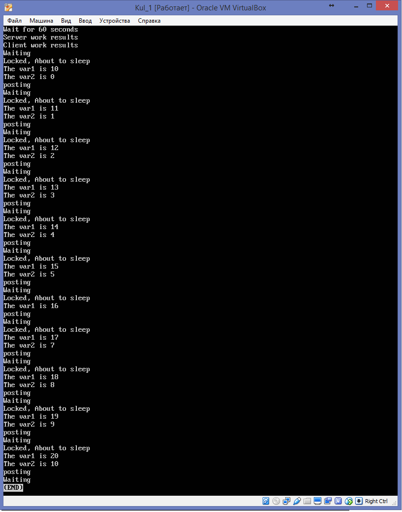

# Сообщения. Разделяемая память. Семафоры.

### Задание

* Написать программу для обмена текстовыми сообщениями между процессами, с использованием механизма разделяемой памяти. Обеспечить синхронизацию обмена с помощью механизма семафоров.
* Написать **Makefile**
* Написать **Dockerfile** и сделать **Docker image** с задачей

### Выполнение

Программа написана по примерам, тем не менее вместо работы с распределенной памятью System V напрямую (`shmem`), работа с памятью идет через `mmap`, то есть с проецированием файла в память. Это наиболее предппочтительный способ работы с распределенной памятью в современных ОС, тем более после завершения программы сегмент памяти созданный `mmap` будет удален.

В моей реализации клиент-сервер общаются с друг другом до тех пор пока не примут `SIGINT`. Для демонстрации в Докер-контейнере написан скрипт, который позволяет программам общаться с друг другом 60 секунд, после чего посылает им `SIGINT` и выводит результаты общения, которые можно сравнить.

### Инструкции по сборке

#### Сборка

```
cd lab6
docker build -t balberinlabs:lab6 .
```
#### Запуск
`docker  run --rm balberinlabs:lab6`


### Готовый образ

```
docker pull rohanzi/balberinlabs:lab6
docker run --rm rohanzi/balberinlabs:lab6
```

### Исходные файлы

#### server.c

```
#include <stdio.h>
#include <sys/mman.h>
#include <sys/types.h>
#include <unistd.h>
#include <fcntl.h>
#include <sys/stat.h>
#include <stdlib.h>
#include <signal.h>
#include <semaphore.h>


#define SHMOBJ_PATH         "/shmjeshu"

sem_t * sem_id;

/* message structure for messages in the shared segment */

struct shared_data {
    int var1;
    int var2;
};

void signal_callback_handler(int signum)
{
    
    /**
     * Semaphore unlink: Remove a named semaphore  from the system.
     */
    if ( shm_unlink("/mysem") < 0 )
    {
        perror("shm_unlink");
    }
    /**
     * Semaphore Close: Close a named semaphore
     */
    if ( sem_close(sem_id) < 0 )
    {
        perror("sem_close");
    }
    
    /**
     * Semaphore unlink: Remove a named semaphore  from the system.
     */
    if ( sem_unlink("/mysem") < 0 )
    {
        perror("sem_unlink");
    }
    
        // Terminate program
    exit(signum);
}


int main(int argc, char *argv[]) {
    int shmfd;
    int vol, cur;
    int shared_seg_size = (1 * sizeof(struct shared_data));   /* want shared segment capable of storing 1 message */
    struct shared_data *shared_msg;      /* the shared segment, and head of the messages list */
    
    signal(SIGINT, signal_callback_handler);
    
    /* creating the shared memory object    --  shm_open()  */
    shmfd = shm_open(SHMOBJ_PATH, O_CREAT | O_RDWR, S_IRWXU | S_IRWXG);
    if (shmfd < 0)
    {
        perror("In shm_open()");
        exit(1);
    }
    
    fprintf(stderr, "Created shared memory object %s\n", SHMOBJ_PATH);
    
    /* adjusting mapped file size (make room for the whole segment to map)      --  ftruncate() */
    ftruncate(shmfd, shared_seg_size);
    
    /**
     * Semaphore open
     */
    sem_id=sem_open("/mysem", O_CREAT, S_IRUSR | S_IWUSR, 1);
    
    /* requesting the shared segment    --  mmap() */
    shared_msg = (struct shared_data *)mmap(NULL, shared_seg_size, PROT_READ | PROT_WRITE, MAP_SHARED, shmfd, 0);
    if (shared_msg == NULL)
    {
        perror("In mmap()");
        exit(1);
    }
    fprintf(stderr, "Shared memory segment allocated correctly (%d bytes).\n", shared_seg_size);
    
    vol = 10;
    cur = 0;
    while(1)
    {
        sleep(2);
        printf("Waiting \n");
        sem_wait(sem_id);
        printf("Locked, About to sleep \n");
        shared_msg->var1 = vol;
        shared_msg->var2 = cur;
        printf("The var1 is %d \n",shared_msg->var1);
        printf("The var2 is %d \n",shared_msg->var2);
        sleep(3);
        sem_post(sem_id);
        printf("posting \n");
        vol++;
        cur++;
    }
    
    if (shm_unlink(SHMOBJ_PATH) != 0) {
        perror("In shm_unlink()");
        exit(1);
    }
    /**
     * Semaphore Close: Close a named semaphore
     */
    if ( sem_close(sem_id) < 0 )
    {
        perror("sem_close");
    }
    
    /**
     * Semaphore unlink: Remove a named semaphore  from the system.
     */
    if ( sem_unlink("/mysem") < 0 )
    {
        perror("sem_unlink");
    }
    
    return 0;
}
```

#### client.c

```
#include <stdio.h>
#include <sys/mman.h>
#include <sys/types.h>
#include <unistd.h>
#include <fcntl.h>
#include <sys/stat.h>
#include <stdlib.h>
#include <signal.h>
#include <semaphore.h>


#define SHMOBJ_PATH         "/shmjeshu"

sem_t * sem_id;

/* message structure for messages in the shared segment */

struct shared_data {
    int var1;
    int var2;
};

void signal_callback_handler(int signum)
{
    
    /**
     * Semaphore unlink: Remove a named semaphore  from the system.
     */
    if ( shm_unlink("/mysem") < 0 )
    {
        perror("shm_unlink");
    }
    
    /**
     * Semaphore Close: Close a named semaphore
     */
    if ( sem_close(sem_id) < 0 )
    {
        perror("sem_close");
    }
    
    /**
     * Semaphore unlink: Remove a named semaphore  from the system.
     */
    if ( sem_unlink("/mysem") < 0 )
    {
        perror("sem_unlink");
    }
        // Terminate program
    exit(signum);
}

int main(int argc, char *argv[]) {
    int shmfd;
    int shared_seg_size = (1 * sizeof(struct shared_data));   /* want shared segment capable of storing 1 message */
    struct shared_data *shared_msg;      /* the shared segment, and head of the messages list */
    
    
    signal(SIGINT, signal_callback_handler);
    
    /* creating the shared memory object    --  shm_open()  */
    shmfd = shm_open(SHMOBJ_PATH, O_CREAT | O_RDWR, S_IRWXU | S_IRWXG);
    if (shmfd < 0)
    {
        perror("In shm_open()");
        exit(1);
    }
    
    fprintf(stderr, "Created shared memory object %s\n", SHMOBJ_PATH);
    
    /* adjusting mapped file size (make room for the whole segment to map)      --  ftruncate() */
    ftruncate(shmfd, shared_seg_size);
    
    /**
     * Semaphore open
     */
    sem_id=sem_open("/mysem", O_CREAT, S_IRUSR | S_IWUSR, 1);
    
    
    /* requesting the shared segment    --  mmap() */
    shared_msg = (struct shared_data *)mmap(NULL, shared_seg_size, PROT_READ | PROT_WRITE, MAP_SHARED, shmfd, 0);
    if (shared_msg == NULL)
    {
        perror("In mmap()");
        exit(1);
    }
    fprintf(stderr, "Shared memory segment allocated correctly (%d bytes).\n", shared_seg_size);
    
    while(1)
    {
        sleep(2);
        printf("Waiting \n");
        sem_wait(sem_id);
        printf("Locked, About to sleep \n");
        printf("The var1 is %d \n",shared_msg->var1);
        printf("The var2 is %d \n",shared_msg->var2);
        sleep(2);
        sem_post(sem_id);
        printf("posting \n");
    }
    
    if (shm_unlink(SHMOBJ_PATH) != 0) {
        perror("In shm_unlink()");
    }
    exit(1);
    /**
     * Semaphore Close: Close a named semaphore
     */
    if ( sem_close(sem_id) < 0 )
    {
        perror("sem_close");
    }
    
    /**
     * Semaphore unlink: Remove a named semaphore  from the system.
     */
    if ( sem_unlink("/mysem") < 0 )
    {
        perror("sem_unlink");
    }
    
    return 0;
}
```

#### start.sh

```
#!/bin/bash
nohup shmemsemserver > server.txt &
nohup shmemsemclient > client.txt &
echo "Wait for 60 seconds"
sleep 60
#Interrupts latest processes with names specified
kill -INT $(pgrep -n shmemsemclient)
kill -INT $(pgrep -n shmemsemclient)
echo "Server work results"
cat server.txt
echo "Client work results"
cat client.txt
```

#### Makefile
```
PREFIX = /usr/local/bin
CC = clang
LIBS =  -lrt -lpthread
.PHONY: all clean install uninstall

all: shmemsemclient shmemsemserver
clean:
	rm -rf shmemsem{client,server} *.o
shmemsemserver.o: server.c
	$(CC)  -c -o shmemsemserver.o server.c $(LIBS)
shmemsemclient.o: client.c
	$(CC)  -c -o shmemsemclient.o client.c $(LIBS)
shmemsemclient: shmemsemclient.o
	$(CC)  -o shmemsemclient shmemsemclient.o $(LIBS)
shmemsemserver: shmemsemserver.o
	$(CC)  -o shmemsemserver shmemsemserver.o $(LIBS)
install:
	install -D shmemsemserver $(PREFIX)/shmemsemserver
	install -D shmemsemclient $(PREFIX)/shmemsemclient
uninstall:
	rm -rf $(PREFIX)/shmemsem{client,server}
```

#### Dockerfile

```
FROM debian:jessie-slim
#FROM alpine
WORKDIR /src
#RUN apk add --update clang binutils gcc clang-libs libc-dev coreutils
RUN apt-get update && apt-get install -y --no-install-recommends \
	libc6-dev clang coreutils binutils gcc make \
	&& rm -rf /var/lib/apt/lists/*
ADD ./src/* ./
RUN make all
RUN make install
RUN cp start.sh /usr/local/bin/start.sh
RUN chmod 755 /usr/local/bin/start.sh
ENTRYPOINT ["start.sh"]
```

### Скриншот

